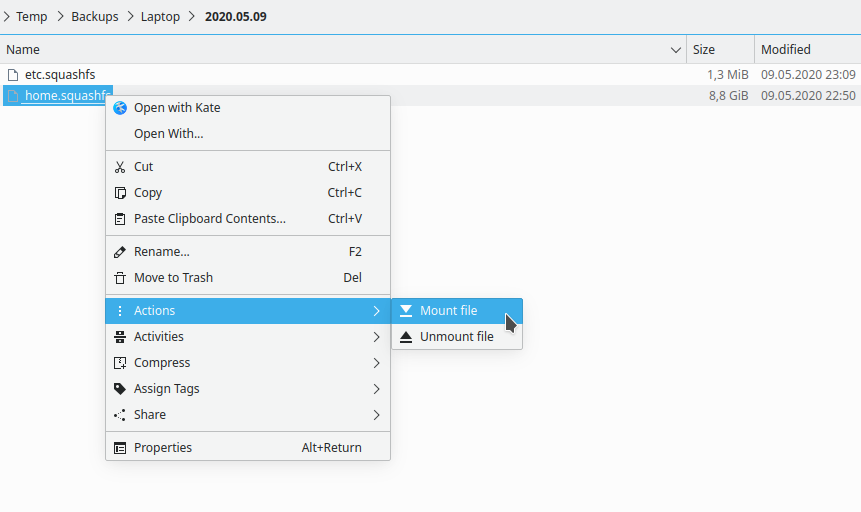

## Dolphin service menu: Universal mounter / unmounter

- Mount any mountable file using "Mount file".
  - After mounting it opens created mount point in your file manager.  
    It creates a mount point in `/tmp` using the name of the file being mounted + first 8 characters of file path's `sha256` hash.
- Unmount previously mounted file using "Unmount file".

## Installation
Place the file in ~/.local/share/kservices5/ServiceMenus 

## Screenshots

